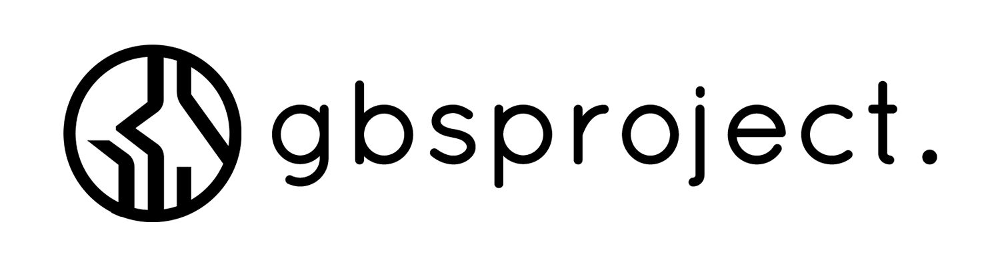

# GBS Project API

## About
- Last updated: February 15 2019
- Serving as Backend API for my LSP Final Project: GBS Project
- Made as one of my early website result
- You can check the changelog by viewing changelog.txt at this root folder
- Database migration as SQL Dump can be found at this root folder (gbsmoneydb-lastlocaldump.sql)

## Built using
- Native PHP 7
- Bootstrap 4
- MySQL (MariaDB)
- Midtrans Payment Gateway (Veritrans)
- Barbaric Way

## Purposed for
- Serving some of client web app function
- Endpoint for my EDC Machine built using ESP8266 and Arduino IDE